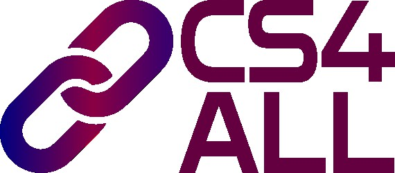

# CS4ALL

  
Department of Computer Science · University of Copenhagen

  
Community, visibility, and support for gender minorities in computer science.

  
CS4ALL is DIKU's community for women and other gender minorities in computer science. The initiative brings people together through mailing lists, events, and practical inclusion work across the department.

  

    <a class="cs4all-button cs4all-button-primary" href="{{ '/join-us/' | absolute_url }}">Join CS4ALL</a>
    <a class="cs4all-button cs4all-button-secondary" href="https://di.ku.dk/english/diversity-and-inclusion/cs4all/" target="_blank" rel="noopener">Official DIKU page</a>
  

## What CS4ALL works on

- Supporting women and other gender minorities in computer science at DIKU.
- Creating safe spaces through targeted mailing lists and networking events.
- Opening broader conversations at DIKU through talks and public CS4ALL events.
- Strengthening inclusion through visible advocacy and department-level change.

## Explore the site

  <a class="cs4all-card" href="{{ '/about-us/' | absolute_url }}">
    <h3>
         
        About us
    </h3>
    

        
        Mission, focus, and how CS4ALL contributes to a more inclusive DIKU.
    

  </a>
  <a class="cs4all-card" href="{{ '/join-us/' | absolute_url }}">
    <h3>Join us</h3>
    
Find the right mailing list, see who can participate, and learn how to get involved.

  </a>
  <a class="cs4all-card" href="{{ '/upcoming-events/' | absolute_url }}">
    <h3>Upcoming events</h3>
    
Check the current status of public CS4ALL events and where to watch for the next one.

  </a>
  <a class="cs4all-card" href="{{ '/past-events/' | absolute_url }}">
    <h3>Past events</h3>
    
Browse recent CS4ALL activities listed in the DIKU event calendar.

  </a>
  <a class="cs4all-card" href="{{ '/members/' | absolute_url }}">
    <h3>Members</h3>
    
See the affiliated employees currently listed on the official CS4ALL page.

  </a>
  <a class="cs4all-card" href="{{ '/contacts/' | absolute_url }}">
    <h3>Contacts</h3>
    
Reach the initiators and the Department of Computer Science.

  </a>

## Why this matters

> "Our mission is that everyone feels included and comfortable at DIKU - and thus has the best conditions and opportunities to achieve success in IT."

CS4ALL is part of DIKU's wider diversity and inclusion work. The community is centered on underrepresented genders in computing, while also inviting the broader department into conversations, talks, and practical action that improve the culture for everyone.
